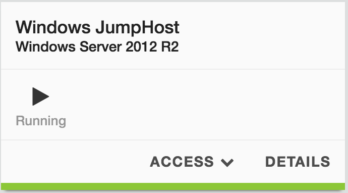

Lab 0.2 - Access your lab
-------------------------

Task 1 - Launch your RDP session
^^^^^^^^^^^^^^^^^^^^^^^^^^^^^^^^

Once your deployment is up and running, you should try to access the JumpHost via RDP.

In the UDF interface, go to Deployment and select the Deployment `iControl LX extensions`

Click on the `Components` tab and find the component called `JumpHost` (in the Systems column)

Click on Access and `RDP`. You should download automatically a shortcut to launch the RDP session

.. warning:: For MAC user, it is recommended to use Microsoft Remote Desktop. You may not be able to access your jumpbox otherwise. It is available in the App store (FREE).

login: administrator
password: cXzTEv8E5

.. note::

    The lab guide is setup as the homepage of your chrome browser

