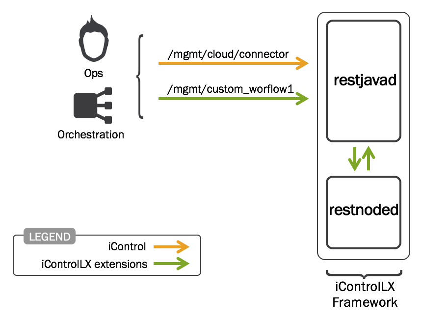

Lab 1.1 - The daemons
---------------------

Task 1 - Understand the two primary daemons
^^^^^^^^^^^^^^^^^^^^^^^^^^^^^^^^^^^^^^^^^^^

When developing iControl LX extensions, there are two daemons to be aware of:

* restjavad
* restnoded

*restjavad* presents F5 iControl REST, the interface to BIG-IP devices and the
iWorkflow platform.

*restnoded* presents services for developing iControl LX extensions, in addition
to acting as the interface to *restjavad* and the iControl REST API.

.. NOTE::
    In the diagram above, the orange line represents an iControl REST resource
    that ships with the BIG-IP/iWorkflow platform.
    The green line represents a REST call to a custom iControl LX extension.

Task 2 - Start/Stop/Restart the daemons
^^^^^^^^^^^^^^^^^^^^^^^^^^^^^^^^^^^^^^^

Connect via ssh to your iWorkflow platform (a shortcut already exist in PuTTY - 10.1.10.20, Root/Default). Execute the
following:

  ``bigstart status restnoded``

Example output:

.. code::

    $ bigstart status restnoded
    restnoded    run (pid 6209) 40 days

.. NOTE::
  You can specify multiple daemons with the ``bigstart`` command. For example,
  the following will get the status of both 'restavad' and 'restnoded':

    ``bigstart status restjavad restnoded``

  Do not specifiy a daemon to get the status of ALL F5 controlled daemons, for example:
    ``bigstart status``

The following bigstart commands are supported:

- ``bigstart status <daemon>``
- ``bigstart start <daemon>``
- ``bigstart restart <daemon>``
- ``bigstart stop <daemon>``

1. Restart the restnoded & restjavad daemons by executing:

``bigstart restart restjavad restnoded``

you won't see any logs in CLI when using this command. You'll need to check the log files

.. toctree::
   :maxdepth: 1
   :glob:
