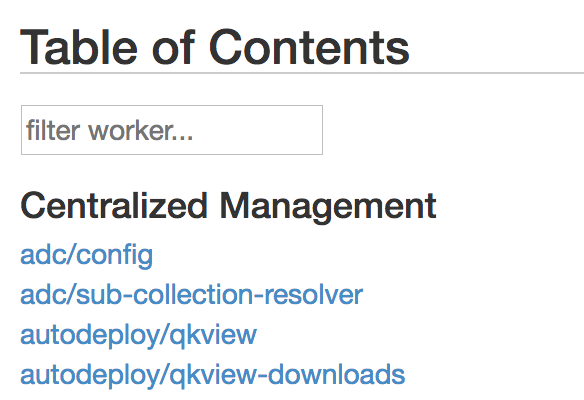
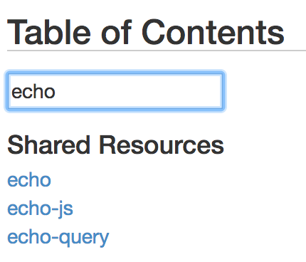
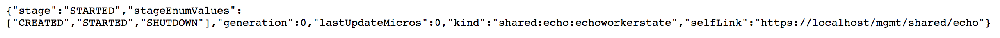
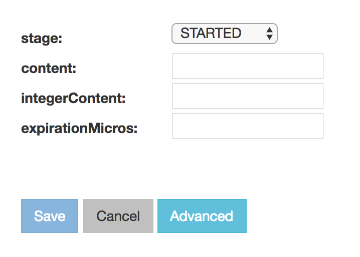
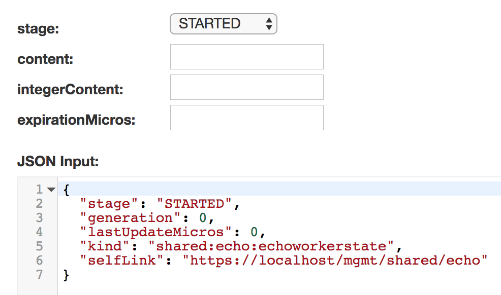
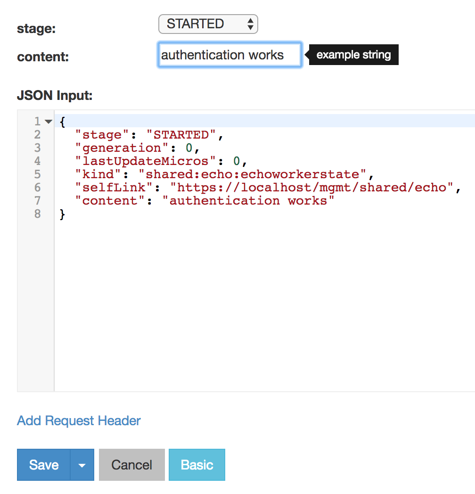

Lab 2.1 - Interact with a REST extension
----------------------------------------

In this exercise, we are going to look at an iControl LX extension that ships
with iControl. This is the iControl LX 'presentation' extension. This iControl LX extension present the REST API with a graphical interface. In this lab, we will test it.

Typically, when you login to iWorkflow via the Web Interface you are redirected
to `/mgmt/xui`. In this exercise we are going to review the REST API via the
Web interface, which looks like this:

.. image:: ../../_static/class1/module2/lab1-image001.png
    :align: center
    :scale: 50%

Task 1 - View the API via web browser
^^^^^^^^^^^^^^^^^^^^^^^^^^^^^^^^^^^^^

1. In your browser, navigate to: https://10.1.10.20/mgmt/toc

2. Enter the 'admin' user credentials (it should be admin / admin).
You are now presented with the top level of REST collections/resource available
on the iWorkflow platform.

Task 2 - Interact with a REST resource
^^^^^^^^^^^^^^^^^^^^^^^^^^^^^^^^^^^^^^

1. To filter the list of iControl REST resources, navigate to the textbox at the
top of the page and enter 'echo':

2. Click on the 'echo' resource.

.. image:: ../../_static/class1/module2/lab1-image004.png
    :align: center
    :scale: 50%

Task 3 - The '/presentation#' extension
^^^^^^^^^^^^^^^^^^^^^^^^^^^^^^^^^^^^^^^

Note that the URI has `/presentation#/` appended to the end of it. This is an
iControlLX extension responsible for rendering the iControl REST resource in the
web interface.

1. Remove the appended presentation#/ and note the raw JSON representation:

2. Click the 'back' button in your browser to return to the /presentation#/
view. The URL should now be:

`https://10.1.10.20/mgmt/shared/echo/presentation#/`

Task 4 - Editing a REST resource
^^^^^^^^^^^^^^^^^^^^^^^^^^^^^^^^

1. Click the blue 'edit' button. You should now see this:

This allows you to edit the value of the '/mgmt/shared/echo' REST resource, via
the 'presentation' extension.

2. Click on the blue 'advanced' button. Now you can see the raw JSON
representation of the REST resource.

3. Try editing the REST resource. In the "content" field,  type: "Authentication works" (check the picture below)
   Note that it synchronizes between the textboxes and the raw 'JSON input' textfield. They are both representations of the same resource.

You are now interacting with the iControl REST resource 'echo', via the
iControlLX 'presentation' extension.

4. Click the blue 'cancel' button to discard your changes.
