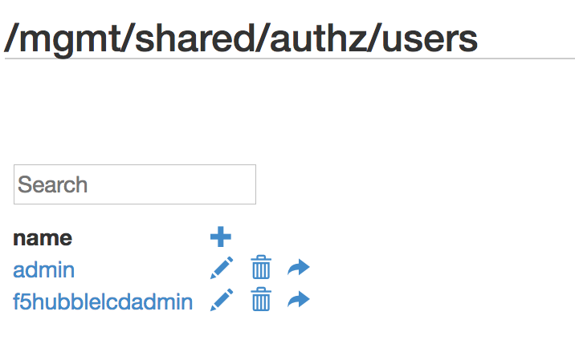
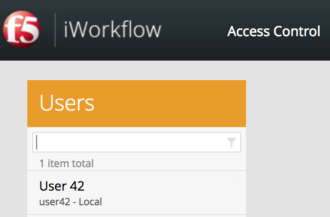

Lab 2.2 - Edit an iControl REST resource via ToC
------------------------------------------------

Task 1 - Review the user accounts
^^^^^^^^^^^^^^^^^^^^^^^^^^^^^^^^^

1. Navigate to /mgmt/toc

2. In the search textbox, type 'authz'

3. From the results, select 'authz/users'

You are now looking at all of the user accounts on your iWorkflow platform.

Task 2 - Create a new user
^^^^^^^^^^^^^^^^^^^^^^^^^^

1. Click the '+' at the top of the user list

2. Enter a previously unused username, for example 'user42'

3. Enter a password in the 'password:' field.

4. Click 'save'

Note the new user in the list.

.. image:: ../../_static/class1/module2/lab2-image002.png
    :align: center
    :scale: 50%

Task 3 - Edit the new user
^^^^^^^^^^^^^^^^^^^^^^^^^^

1. Click on the new user.

Note the displayName has been auto-populated  with the username value.

2. Click the 'Edit' button.

3. Change the value of 'displayName'. We used: User 42

4. Click 'Save'

.. image:: ../../_static/class1/module2/lab2-image003.png
    :align: center
    :scale: 50%

Task 4 - Login as the new user
^^^^^^^^^^^^^^^^^^^^^^^^^^^^^^

1. Open a new browser window and navigate to: https://<ip_address>/

2. Login as the new user.

Note the different display name and username.

Also note that you can't do very much with this user. It has not been added to
any roles or given any permissions. Close this browser and go back to the previous one.
