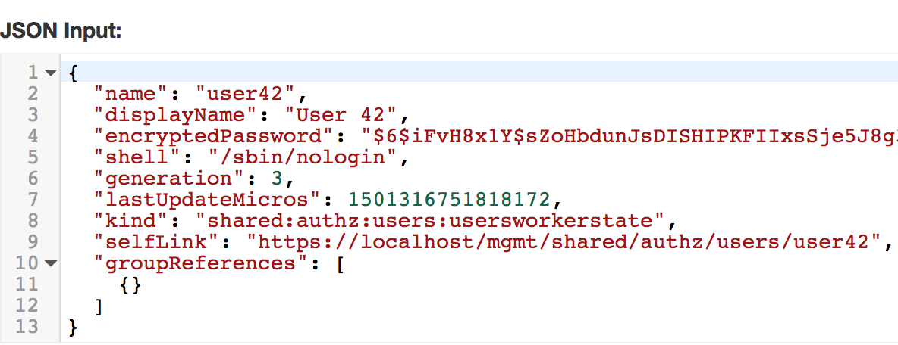

Lab 2.3 - Advanced (raw JSON)
-----------------------------

Task 1 - View the JSON representation of a user account
^^^^^^^^^^^^^^^^^^^^^^^^^^^^^^^^^^^^^^^^^^^^^^^^^^^^^^^

1. Navigate to your list of user accounts:

https://10.1.10.20/mgmt/shared/authz/users/presentation#/

2. Click on the user you created earlier (user42 ?).

3. Click the 'Edit' button.

4. Click the 'Advanced' button. A JSON input window appear

Note that the value in JSON match those presented above in the /presentation#/
representation.

Task 2 - Edit a user account's JSON representation
^^^^^^^^^^^^^^^^^^^^^^^^^^^^^^^^^^^^^^^^^^^^^^^^^^

1. In the "JSON Input:" field, edit the value of 'displayName'.

Note that it automatically changes in the 'presentation' view above.

2. Click 'Save' or 'Cancel'.

3. Click 'Parent' to return to the list of users.

Task 3 - delete the user
^^^^^^^^^^^^^^^^^^^^^^^^

1. Click the 'trash can' next to the user you created.
