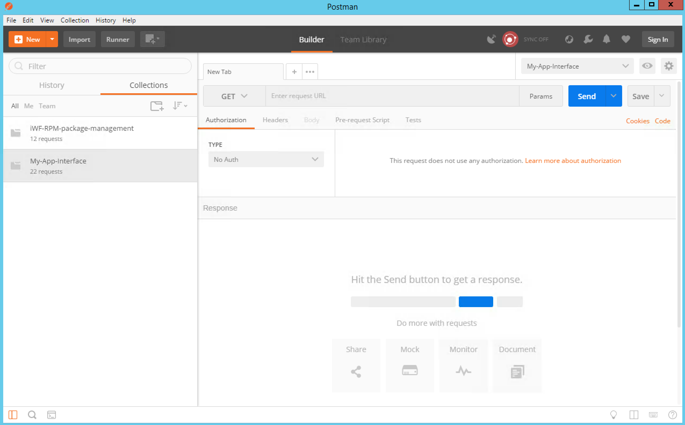
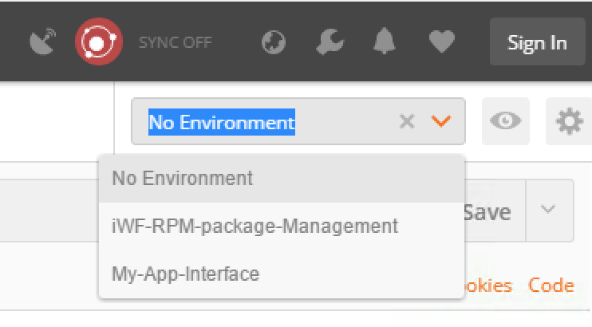
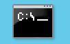

Lab 5.1 - Install the iControl LX package
-----------------------------------------

Task 1 - Install the iControl LX RPM package
^^^^^^^^^^^^^^^^^^^^^^^^^^^^^^^^^^^^^^^^^^^^

To save some time, we already have pushed the iControl LX RPM on your iworkflow platform.

You can connect to your iWorkflow platform (10.1.10.20) and check the directory /var/config/rest/downloads:

.. code::

  # ls /var/config/rest/downloads/
  my-app-interface-0.1-001.noarch.rpm  tmp

To install your RPM, you have two different options:

* use the POSTMAN application and the collection already setup in it and do the calls one by one
* use the newman scripts that will automatically run all the required API calls

Use the POSTMAN application
"""""""""""""""""""""""""""

Click on the POSTMAN icon in the task bar (or on the Desktop)

you should see this:

Click on the collection `iWF-RPM-package-management` and then on `2A_Install_RPM`

.. image:: ../../_static/class1/module5/lab1-image003.png
    :align: center
    :scale: 50%

Here you can see that this folder has 4 different API calls:

* Get an Auth token from iWF
* Extend the timeout of this token
* Install our RPM
* Check whether it installed successfully or not (you may need to do play this requets a few times before it's fully installed)

Select the `iWF-RPM-package-Management` environment (top right of the windows)

Now, we are ready to execute our calls.

Here is the procedure:

* select the call: `Request a Token from iWorkflow` and click on SEND, you may review the response to ensure it was successful
* select the call: `Increase Auth Token Timeout` and click on SEND, you may review the response
* select the call: `install RPM` and click on SEND, you may review the response
* select the call: `check RPM install process status` and click on SEND

With the final call, you should see something like this (check the status value, it should be *FINISHED*):

.. code::

  {
    "packageFilePath": "/var/config/rest/downloads/my-app-interface-0.1-001.noarch.rpm",
    "packageName": "my-app-interface-0.1-001.noarch",
    "operation": "INSTALL",
    "packageManifest": {
        "tags": [
            "IAPP"
        ]
    },
    "id": "9bfc0b20-19e2-4565-9ffe-44221fba239e",
    "status": "FINISHED",
    "startTime": "2017-10-29T02:37:46.504-0700",
    "endTime": "2017-10-29T02:37:46.957-0700",
    "userReference": {
        "link": "https://localhost/mgmt/shared/authz/users/admin"
    },
    "identityReferences": [
        {
            "link": "https://localhost/mgmt/shared/authz/users/admin"
        }
    ],
    "ownerMachineId": "075786c3-27a2-45da-8b06-86dcbb73a1c5",
    "generation": 3,
    "lastUpdateMicros": 1509269866957258,
    "kind": "shared:iapp:package-management-tasks:iapppackagemanagementtaskstate",
    "selfLink": "https://localhost/mgmt/shared/iapp/package-management-tasks/9bfc0b20-19e2-4565-9ffe-44221fba239e"
  }

Use the newman script
"""""""""""""""""""""

.. warning::

  If you've already setup the extension by following the POSTMAN process, this will fail. You'll need to delete the extension first

newman gives you the capability to run a POSTMAN collection or a specific folder. When you have multiple calls to do, it may be easier to use newman.

If you want more information about newman, you can review this `newman_overview`_

.. _newman_overview: https://www.getpostman.com/docs/postman/collection_runs/command_line_integration_with_newman

newman is already installed and setup in your JumpHost. All the different scripts that will be used in this lab are stored in the `Lab` folder on your desktop.

To execute newman, launch a MS Command Prompt. You have a shortcust in your taskbar that will be launched in the right folder automatically

you should see this:

.. image:: ../../_static/class1/module5/lab1-image006.png
    :align: center
    :scale: 50%

to launch the newman script that install the RPM, run the following command `1_Install_RPM`

.. code::

  C:\Users\Administrator\Desktop\Lab\Postman>1_Install_RPM.bat

This script will execute all the API calls in the 2A_Install_RPM collection, you should see this:

.. image:: ../../_static/class1/module5/lab1-image007.png
    :align: center
    :scale: 50%

Task 2 -  Check it has been installed successfully
^^^^^^^^^^^^^^^^^^^^^^^^^^^^^^^^^^^^^^^^^^^^^^^^^^

You can check that the extension was successfully installed in different ways:

* Check that the extension is installed in /var/config/rest/iapps/

  .. code::

     # ls /var/config/rest/iapps/
     my-app-interface  RPMS  tmp.7399485599133304707

* Check /var/log/restnoded/restnoded.log

  .. code::

     tail /var/log/restnoded/restnoded.log
     Sun, 29 Oct 2017 09:53:14 GMT - finest: [LoaderWorker] triggered at path:  /var/config/rest/iapps/my-app-interface/nodejs
     Sun, 29 Oct 2017 09:53:14 GMT - finest: [LoaderWorker] triggered at path:  /var/config/rest/iapps/my-app-interface/nodejs/ictrl-app-interface-ConfigProcessor.js
     Sun, 29 Oct 2017 09:53:14 GMT - finest: socket 1 closed
     Sun, 29 Oct 2017 09:53:14 GMT - info: my-app-interface - onStart()
     Sun, 29 Oct 2017 09:53:14 GMT - config: [RestWorker] /shared/my-app-interface has started. Name:ipam_extension

* Use Postman to test your extension. Try to access https://10.1.10.20/mgmt/shared/my-app-interface/exmaple. You'll need to authenticate yourself as student/student. You have already a folder in your imported postman collection to do it. it's in the `My-App-Interface` collection and in the `Test-Interface` folder.

  .. image:: ../../_static/class1/module5/lab1-image009.png
    :align: center
    :scale: 50%

  .. note::

    make sure to select the environment `My-App-Interface`

    .. image:: ../../_static/class1/module5/lab2-image002.png
      :align: center
      :scale: 50%

  You should see something like this:

  .. image:: ../../_static/class1/module5/lab1-image010.png
    :align: center
    :scale: 50%

.. note::

  To protect who can use this extension, we updated iWorkflow to only allow the student user to use this extension. This is done here in the iWorkflow interface:

  .. image:: ../../_static/class1/module5/lab1-image008.png
    :align: center
    :scale: 50%
