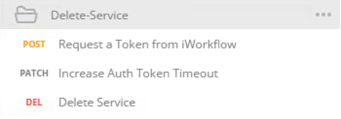
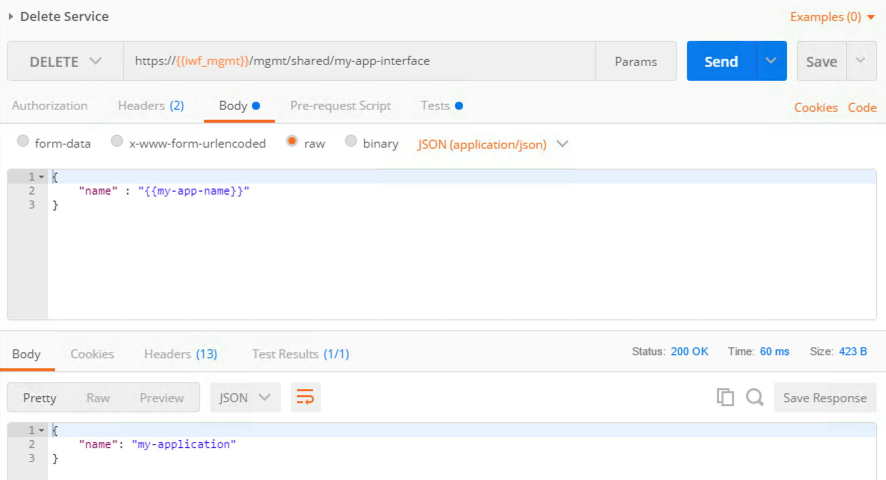
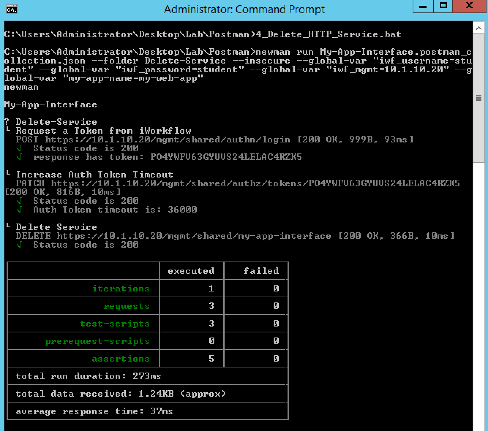

Lab 5.2 - Test and Troubleshoot the Extension
---------------------------------------------

Task 1 - Deploy Services via the Extension
^^^^^^^^^^^^^^^^^^^^^^^^^^^^^^^^^^^^^^^^^^

To deploy services, we need to push ``POST`` requests to
``/mgmt/share/my-app-interface``.

Just like for the RPM installation process, we can either use a Postman
collection or use newman.

To see what the extension is doing:

* You can monitor its logs in ``/var/log/restnoded/restnoded.log``: Open a
  Putty session on iWorkflow and let the following command run:
  ``tail -f /var/log/restnoded/restnoded.log``. This way you should see all
  action logged by the extension.

* Connect to your BIG-IP UI (login ``admin``, password ``admin``) and
  iWorkflow UI (login ``student``, password ``student``) to see services being
  added/deleted. You have shortcuts in your Chrome browser

.. NOTE:: Some limitations of the extension / IPAM solution to be aware of:

  * Only 8 IPs have been allocated to deploy services in the IPAM simulator
    (10.1.20.100-10.1.20.107) so don't try to deploy more services, it will fail

  * Only POST / DELETE have been setup for now, don't try to update a service

  * Here we only handle the use case where we deploy 2 pool members for each
    app. Don't try to push only one server or more than 2

Use Postman
~~~~~~~~~~~

Perform the following steps to complete this task:

#. Open your Postman application in your JumpHost and select the collection
   called ``My-App-Interface``

   .. image:: ../../_static/class1/module5/lab2-image001.png
      :align: center
      :scale: 50%

#. Select also ``My-App-Interface`` environment variables

   .. image:: ../../_static/class1/module5/lab2-image002.png
      :align: center
      :scale: 50%

#. In this collection you have different things you can do:

   * Deploy a HTTP and/or TCP Service
   * Delete a Service

#. For each workflow you want to trigger, make sure that you do the Calls in
   the order they are set in the folder.

   For example to deploy a HTTP Service, in the folder ``Create-Service-HTTP``:

   1. Click ``Request a token from iWorkflow`` and click :guilabel:`Send`
   2. Click ``Increase Auth token timeout`` and click :guilabel:`Send`
   3. Click ``Create HTTP Service`` and click :guilabel:`Send`

You can review that everything happened as expected through the iWorkflow and
BIG-IP UI.

.. NOTE:: Your service definition is done in your ``My-App-Interface``
   environment. So if you want to deploy multiple services, make sure you
   update it accordingly.

Use Postman - Create HTTP Service Example
~~~~~~~~~~~~~~~~~~~~~~~~~~~~~~~~~~~~~~~~~

#. Here is an example of deploying the HTTP Service (``Create-Service-HTTP``
   folder in POSTMAN):

   .. image:: ../../_static/class1/module5/lab2-image004.png
      :align: center
      :scale: 50%

#. Here is the response from the service creation:

   .. image:: ../../_static/class1/module5/lab2-image005.png
      :align: center
      :scale: 50%

#. Output from ``/var/log/restnoded/restnoded.log`` on iWorkflow:

   .. code::

      Sun, 29 Oct 2017 12:30:07 GMT - info: DEBUG: my-app-interfaceIPAM REST Call - onPost -
      Sun, 29 Oct 2017 12:30:07 GMT - finest: socket 3 closed
      Sun, 29 Oct 2017 12:30:07 GMT - info: DEBUG: my-app-interfaceIPAM REST Call - onPost - the retrieved IP is: 10.1.20.103
      Sun, 29 Oct 2017 12:30:07 GMT - info: DEBUG: my-app-interface update service BODY is: "{ \"name\": \"my-application\", \"tenantTemplateReference               \": { \"link\": \"https://localhost/mgmt/cm/cloud/tenant/templates/iapp/f5-http-lb\"}, \"tenantReference\": { \"link\": \"https://localhost/mgmt               /cm/cloud/tenants/student\"},\"vars\": [ { \"name\" : \"pool__port\", \"value\" : \"80\"},{\"name\": \"pool__addr\",\"value\": \"10.1.20.103\"}]               , \"tables\": [\n\t{\n\t\t\"name\": \"pool__Members\",\n\t\t\"columns\": [\n\t\t\t\"IPAddress\",\n\t\t\t\"State\"\n\t\t],\n\t\t\"rows\": [\n\t\t               \t[\n\t\t\t\t\"10.1.10.10\",\n\t\t\t\t\"enabled\"\n\t\t\t],\n\t\t\t[\n\t\t\t\t\"10.1.10.10\",\n\t\t\t\t\"enabled\"\n\t\t\t]\n\t\t]\n\t}\n],\"pro               perties\": [{\"id\": \"cloudConnectorReference\",\"isRequired\": false, \"value\": \"https://localhost/mgmt/cm/cloud/connectors/local/58df07a5-f               51c-45ac-a35b-406cfb35840c\"}],\"selfLink\": \"https://localhost/mgmt/cm/cloud/tenants/student/services/iapp/my-application\"}"
      Sun, 29 Oct 2017 12:30:07 GMT - info: DEBUG: my-app-interface - function RestPostRequest, Service created successfully

#. Logging as ``student`` on the iWorkflow UI:

   .. image:: ../../_static/class1/module5/lab2-image006.png
      :align: center
      :scale: 50%

#. Check our BIG-IP configuration via the UI:

   .. image:: ../../_static/class1/module5/lab2-image007.png
      :align: center
      :scale: 50%

Use Newman
~~~~~~~~~~

#. Launch the command prompt that is pinned in your taskbar

   .. image:: ../../_static/class1/module5/lab1-image006.png
      :align: center
      :scale: 50%

#. You already have a few scripts setup to deploy/delete services:

   * ``2_Create_HTTP_Service``: will create a HTTP based service
   * ``3_Create_TCP_Service``:  will create a TCP based service
   * ``4_Delete_HTTP_Service``: will delete the created HTTP based service
   * ``5_Delete_TCP_Service``: will delete the created TCP based service

   .. NOTE:: If you want to change a little the service created, you can edit the
      relevant bat script. You'll find all the parameters related to the service
      in the script. You can open the folder containing all the scripts, right
      click on the script you want to update and edit it with Notepad++

   .. image:: ../../_static/class1/module5/lab2-image003.png
      :align: center
      :scale: 50%

Use Newman - Create HTTP Service Example
~~~~~~~~~~~~~~~~~~~~~~~~~~~~~~~~~~~~~~~~

#. We launch the command prompt that is pinned in your taskbar

   .. image:: ../../_static/class1/module5/lab1-image006.png
      :align: center
      :scale: 50%

#. We will launch the script called ``2_Create_HTTP_Service`` and review the
   output

   .. image:: ../../_static/class1/module5/lab2-image010.png
      :align: center
      :scale: 50%

#. Here is the ``/var/log/restnoded/restnoded.log`` output on iWorkflow:

   .. code::

      Sun, 29 Oct 2017 12:50:32 GMT - info: DEBUG: my-app-interfaceIPAM REST Call - onPost -
      Sun, 29 Oct 2017 12:50:32 GMT - finest: socket 5 closed
      Sun, 29 Oct 2017 12:50:32 GMT - info: DEBUG: my-app-interfaceIPAM REST Call - onPost - the retrieved IP is: 10.1.20.104
      Sun, 29 Oct 2017 12:50:32 GMT - info: DEBUG: my-app-interface update service BODY is: "{ \"name\": \"my-web-app\", \"tenantTemplateReference\": { \"link\": \"https://localhost/mgmt/cm/cloud/tenant/templates/iapp/f5-http-lb\"}, \"tenantReference\": { \"link\": \"https://localhost/mgmt/cm/cloud/tenants/student\"},\"vars\": [ { \"name\" : \"pool__port\", \"value\" : \"80\"},{\"name\": \"pool__addr\",\"value\": \"10.1.20.104\"}], \"tables\": [\n\t{\n\t\t\"name\": \"pool__Members\",\n\t\t\"columns\": [\n\t\t\t\"IPAddress\",\n\t\t\t\"State\"\n\t\t],\n\t\t\"rows\": [\n\t\t\t[\n\t\t\t\t\"10.1.10.10\",\n\t\t\t\t\"enabled\"\n\t\t\t],\n\t\t\t[\n\t\t\t\t\"10.1.10.11\",\n\t\t\t\t\"enabled\"\n\t\t\t]\n\t\t]\n\t}\n],\"properties\": [{\"id\": \"cloudConnectorReference\",\"isRequired\": false, \"value\": \"https://localhost/mgmt/cm/cloud/connectors/local/58df07a5-f51c-45ac-a35b-406cfb35840c\"}],\"selfLink\": \"https://localhost/mgmt/cm/cloud/tenants/student/services/iapp/my-web-app\"}"
      Sun, 29 Oct 2017 12:50:32 GMT - info: DEBUG: my-app-interface - function RestPostRequest, Service created successfully

#. You can check the service got deployed properly on iWorkflow (student tenant) and on your BIG-IP

   .. image:: ../../_static/class1/module5/lab2-image011.png
      :align: center
      :scale: 50%

   .. image:: ../../_static/class1/module5/lab2-image012.png
      :align: center
      :scale: 50%

Task 2 - Delete services via the extension
^^^^^^^^^^^^^^^^^^^^^^^^^^^^^^^^^^^^^^^^^^

Use Postman - Delete HTTP Service Example
~~~~~~~~~~~~~~~~~~~~~~~~~~~~~~~~~~~~~~~~~

Here is an example of removing the HTTP service (``Delete-Service`` folder in
Postman):

Here is the response when we delete the service:

Output from ``/var/log/restnoded/restnoded.log`` on iWorkflow:

.. code::

   Sun, 29 Oct 2017 12:47:38 GMT - finest: socket 4 opened
   Sun, 29 Oct 2017 12:47:38 GMT - info: my-app-interface - onDelete()
   Sun, 29 Oct 2017 12:47:38 GMT - finest: socket 4 closed
   Sun, 29 Oct 2017 12:47:38 GMT - info: DEBUG: my-app-interface - onDelete : VS_IP is: 10.1.20.104
   Sun, 29 Oct 2017 12:47:39 GMT - info: DEBUG: my-app-interface - onDelete : Service Deleted, release IP from IPAM: 10.1.20.104

Check that your service disappeared from iWorkflow and BIG-IP

Use newman - Delete HTTP Service Example
~~~~~~~~~~~~~~~~~~~~~~~~~~~~~~~~~~~~~~~~

We will launch the script called ``4_Delete_HTTP_Service`` and review the output

Here is the ``/var/log/restnoded/restnoded.log`` output on iWorkflow:

.. code::

   Sun, 29 Oct 2017 13:00:53 GMT - info: my-app-interface - onDelete()
   Sun, 29 Oct 2017 13:00:53 GMT - finest: socket 6 closed
   Sun, 29 Oct 2017 13:00:54 GMT - info: DEBUG: my-app-interface - onDelete : VS_IP is: 10.1.20.104
   Sun, 29 Oct 2017 13:00:54 GMT - info: DEBUG: my-app-interface - onDelete : Service Deleted, release IP from IPAM: 10.1.20.104

You can check the service got deleted properly on iWorkflow (student tenant)
and on your BIG-IP
