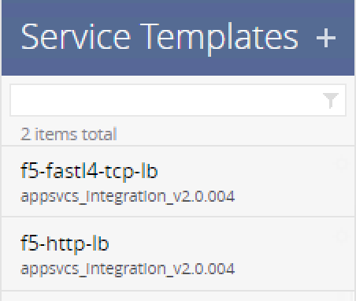

Module 5 - My First iControl LX Extension
=========================================

When you build a declarative interface, your interface should NOT ask for F5
domain specific knowledge. The consumer of your service catalog should not have
to know what is a F5 Virtual Server, an iRule, a L7 policy, etc... it should be
as abstracted as possible and only focus on information the the consumer is
aware of.

Usually if an application engineer wants to deploy an ADC configuration, here
are the information he can provide:

* Service name
* Service template to use
* Service port
* Servers IP Address
* Servers port
* Servers status
* maybe some application specific attributes

If such an application was to be deployed via a REST API interface, the POST
request (to deploy the service) could look like this:

.. code::

   POST /.../my-app-interface
   {
       "name": "{{my-app-name}}",
       "template" : "f5-http-lb",
       "vars": [
                   {
                       "name": "pool__port",
                       "value": "{{service-port}}"
                   }
       ],
       "tables": [{
           "name": "pool__Members",
           "columns": [
               "IPAddress",
               "State"
           ],
           "rows": [
               [
                   "{{server1-addr}}",
                   "enabled"
               ], [
                   "{{server2-addr}}",
                   "enabled"
               ]
           ]
       }]
   }

An example of an attribute that a consumer shouldn't have to provide is our
Virtual Server IP. The consumer doesn't own this segment of the network and
cannot know which IP to specify.  We see more and more requests where they
expect the ADC solution to be able to retrieve this information on its own.

In this lab, we will deploy an iControl LX extension that will communicate with
an IPAM solution to populate automatically this information.

iWorkflow is already setup with 2 service templates:

* HTTP service
* TCP service

Our extension will do the following:

* Receive POST/DELETE requests
* Retrieve an IP from our IPAM solution (we use an iRule to simulate this. It's
  on the BIG-IP)
* Complete the received payload with the information needed by iWorkflow to
  trigger those templates
* Send an updated POST/DELETE requests to iWorkflow to deploy/delete the
  relevant service

**Exercises in this Module**

- Lab 5.1 - Install the iControl LX Package

  - Task 1 - Install the iControl LX RPM Package
  - Task 2 - Check the Package was Successfully Installed

- Lab 5.2 - Test and Troubleshoot the Extension

  - Task 1 - Deploy Services via the Extension
  - Task 2 - Delete Services via the Extension

.. toctree::
   :maxdepth: 1
   :glob:

   lab*
