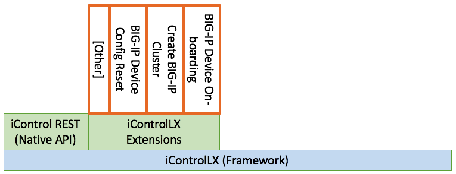

***********************************
Class 4 - F5 iControl LX extensions
***********************************

This class will teach you how to create F5 iControl REST API extensions. If you
are NOT familiar with the iControl REST API, here are the labs you are looking
for `Automation & Orchestration Introduction Course
<http://f5-automation-labs.readthedocs.io/en/latest/>`_.

While this guide assumes no prior experience with the iControl LX framework, it
does assume that the reader has obtained a basic understanding of REST APIs,
Javascript, and asynchronous, event-driven programming.

For more about Node.js, refer to: `Nodejs.org <https://nodejs.org/en/about/>`_.

If you want to get in on the awesome world of Node.js, I highly recommend the
free on-line training resource at `Codecademy
<https://www.codecademy.com/learn/javascript>`_ to get you started.

**What is iControl?**

iControl is the REST API implemented on F5's BIG-IP devices and the iWorkflow
platform. This of us focussed on automation use the REST API over the GUI/CLI.

**What is iControl LX?**

iControl LX (iControl Language eXtension) is the framework upon which F5's
iControl REST API is developed, among other things, as show in the following
diagram:

.. image:: ../_static/class4/image001.png
    :align: center

**What is an iControl LX extension?**

An iControlLX extension represents additional functionality built upon the
iControlLX framework, and presented through the iControl REST API.

.. image:: ../_static/class4/image002.png
    :align: center

F5 has already developed some iControl LX extensions to simplify operational
processes. These extensions are available on `DevCentral
<https://devcentral.f5.com/wiki/DevOps.Default.aspx>`_ and are built to address
the following use cases:

* BIG-IP Device On-boarding / Device config reset
* Create BIG-IP Cluster

This training lab concerns itself with teaching you how to develop your own
iControlLX extensions.

**What else does the iControl LX framework do?**

You will notice that the iControl LX framework is references in F5 iAppsLX.
iAppsLX use specialist iControl LX workers, in addition to an optional
presentation layer, to deliver F5's net generation application
templating system.

.. image:: ../_static/class4/image004.png
    :align: center

**What is iControl LX made of?**

The iControlLX framework consists of a `Node.js
<https://nodejs.org/>`_ implementation, in addition to supporting services that
enable interaction with F5 technologies. For example, developers can use
`restOperation()` to communicate with a *trusted* BIG-IP device, instead of
crafting a HTTP transaction and cooding the auth/trust themselves. For more
on these iControlLX services, visit the `iControl LX SDK <Get a link>`_. Or, just
follow the lab and we will reference the SDK as appropriate.

As the DevOps mantra says, "Fail Fast, Fail Forward!"

.. toctree::
   :maxdepth: 1
   :glob:

   module*/module*
