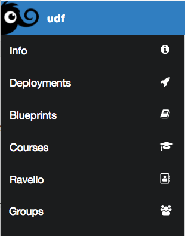

Lab 0.1 - Access UDF and start your lab
---------------------------------------

Task 1 - Access UDF and start your deployment
^^^^^^^^^^^^^^^^^^^^^^^^^^^^^^^^^^^^^^^^^^^^^

Connect to UDF and go to "Courses".

Do a search for a Course called "Class XXX - ISC - iControl LX extensions". There will be 2 classes at ISC around iControl LX extensions so make sure whether you're part of Class 1 or Class2.

Join this class and it should start your deployment

Task 2 - Wait for your deployment to be started
^^^^^^^^^^^^^^^^^^^^^^^^^^^^^^^^^^^^^^^^^^^^^^^

The deployment will take some time, be patient (5-10 minutes)

