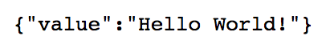
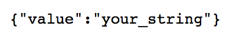

Lab 4.1 - Creating the Hello-World iControl LX extension
--------------------------------------------------------

iControl LX extensions are distributed as RPMs (RedHat Package Management system) when you want to leverage something existing. However when you start from scratch, you'll need to create your extension and then build a RPM that you can distribute accordingly

Task 1 - Create our iControl LX extension onto iWorkflow
^^^^^^^^^^^^^^^^^^^^^^^^^^^^^^^^^^^^^^^^^^^^^^^^^^^^^^^^

iControl LX extension can be installed on either BIG-IP or iWorkflow platform. For this lab, we will use iWorkflow.

Connect to your iWorkflow platform (10.1.1.12 if you use our topology).

iControl LX extension resides in `/var/config/rest/iapps/`. This is where you need to create your iControl LX extension. Usually you will create:

* a folder that is the name of your app: HelloWorld.

.. note::

  this folder name is important since this is what will be used as the RPM name when we will create our package later.

* inside the app folder name, another folder called nodejs that will contain your extension

Let's create our directory tree. On your iWorkflow platform, execute:

``mkdir -p /var/config/rest/iapps/HelloWorld/nodejs/``

Now that we have our directoy, we need to create our extension. Use your preferred editor and create a file called `hello_world.js` in `/var/config/rest/iapps/HelloWorld/nodejs/`

``vi /var/config/rest/iapps/HelloWorld/nodejs/hello_world.js``

Copy / paste the following content into your file:

.. code-block:: javascript

    /**
    * A simple iControl LX extension that handles only HTTP GET
    */
    function HelloWorld() {}

    HelloWorld.prototype.WORKER_URI_PATH = "ilxe_lab/hello_world";
    HelloWorld.prototype.isPublic = true;

    /**
    * handle onGet HTTP request
    */
    HelloWorld.prototype.onGet = function(restOperation) {
      restOperation.setBody(JSON.stringify( { value: "Hello World!" } ));
      this.completeRestOperation(restOperation);
    };

    /**
    * handle /example HTTP request
    */
    HelloWorld.prototype.getExampleState = function () {
      return {
        "supports":"none"
      };
    };

    module.exports = HelloWorld;

Once our extension is created, we need to load it into restnoded. When an extension is loaded from a RPM, it is done automatically. However here, we will need to do it ourselves:

use the following command to make restnoded aware of our extension:

``restcurl shared/nodejs/loader-path-config -d '{"workerPath": "/var/config/rest/iapps/HelloWorld"}'``

the output should look like this:

.. code::

  $ restcurl shared/nodejs/loader-path-config -d '{"workerPath": "/var/config/rest/iapps/HelloWorld"}'
  {
    "id": "ad130c79-59a0-49c7-a7e7-ff39efe956b5",
    "workerPath": "/var/config/rest/iapps/HelloWorld",
    "generation": 1,
    "lastUpdateMicros": 1508242306312732,
    "kind": "shared:nodejs:loader-path-config:loaderpathstate",
    "selfLink": "https://localhost/mgmt/shared/nodejs/loader-path-config/ad130c79-59a0-49c7-a7e7-ff39efe956b5"
  }

The logfile restnoded.0.log will give you the ability to track whether your extension is loaded as expected. Run the following command to ensure everything went smoothly:

``grep HelloWorld /var/log/restnoded/restnoded.log``

the output should look like this:

.. code::

  Tue, 17 Oct 2017 12:11:46 GMT - finest: [LoaderWorker] triggered at path:  /var/config/rest/iapps/HelloWorld
  Tue, 17 Oct 2017 12:11:46 GMT - finest: [LoaderWorker] triggered at path:  /var/config/rest/iapps/HelloWorld/nodejs
  Tue, 17 Oct 2017 12:11:46 GMT - finest: [LoaderWorker] triggered at path:  /var/config/rest/iapps/HelloWorld/nodejs/hello_world.js
  Tue, 17 Oct 2017 12:11:46 GMT - config: [RestWorker] /ilxe_lab/hello_world has started. Name:HelloWorld

Task 2 - Check our iControl LX extension is working
^^^^^^^^^^^^^^^^^^^^^^^^^^^^^^^^^^^^^^^^^^^^^^^^^^^

In your web browser, navigate to:

``https://10.1.1.12/mgmt/ilxe_lab/hello_world``

you should see something like this:

You could also use `curl` in CLI:

``curl -k -u admin:admin https://10.1.1.12/mgmt/ilxe_lab/hello_world``

.. code::

  $ curl -k -u admin:admin https://192.168.143.30/mgmt/ilxe_lab/hello_world
  {"value":"Hello World!"}

Or a REST client like POSTMAN.

Another test is to connect to our `/example` uri. Navigate with your browser to:

``https://10.1.1.12/mgmt/ilxe_lab/hello_world/example``

you should see something like this:

You can also use curl in CLI:

``curl -k -u admin:admin https://10.1.1.12/mgmt/ilxe_lab/hello_world/example``
