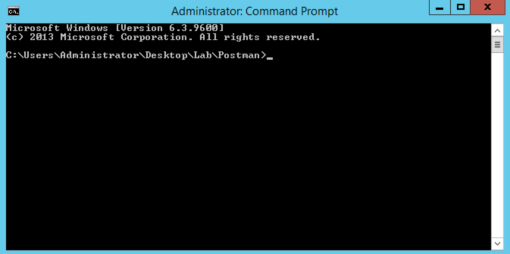

Lab 5.2 - Test and troubleshoot the extension
---------------------------------------------

Task 1 - Deploy services via the extension
^^^^^^^^^^^^^^^^^^^^^^^^^^^^^^^^^^^^^^^^^^

To deploy services , we need to push POST requests to /mgmt/share/my-app-interface.

Just like for the RPM installation process, we can either use a POSTMAN collection or use newman.

To see what the extension is doing:

* you can monitor its logs in /var/log/restnoded/restnoded.log: Open a Putty session on iWorkflow and let the following command run: `tail -f /var/log/restnoded/restnoded.log` . This way you should see all action logged by the extension.
* Connect to your BIG-IP UI and iWorkflow UI to see services being added/deleted. You have shortcuts in your Chrome browser

.. Note::

  Some limitation of the extension / IPAM solution to be aware of:

  * only 8 IPs have been allocated to depoy services in the IPAM simulator (10.1.20.100-10.1.20.107) so don't try to deploy more services, it will fail
  * only POST / DELETE have been setup for now, don't try to update a service
  * Here we only handle the use case where we deploy 2 pool members for each app. Don't try to push only one server or more than 2.

Use Postman
"""""""""""

Open your Postman application in your JumpHost and select the collection called `My-App-Interface`

.. image:: ../../_static/class4/module5/lab2-image001.png
    :align: center
    :scale: 50%

Select also `My-App-Interface` environement variables

.. image:: ../../_static/class4/module5/lab2-image002.png
    :align: center
    :scale: 50%

In this collection you have different things you can do:

* Deploy a HTTP and/or TCP Service
* Delete a Service

For each workflow you want to trigger, make sure that you do the Calls in the order they are set in the folder.

For example to deploy a HTTP Service, in the folder Create-Service-HTTP:

1. Click `Request a token from iWorkflow` and click SEND
2. Click `Increase Auth token timeout` and click SEND
3. Click `Create HTTP Service` and click SEND

You can review that everything happened as expected through the iWorkflow and BIG-IP UI.

.. Note::

  Your service definition is done in your `My-App-Interface` environment. So if you want to deploy multiple services, make sure you update it accordingly.

Use newman
""""""""""

Launch the command prompt that is pinned in your taskbar

You already have a few scripts setup to deploy/delete services:

* 2_Create_HTTP_Service: will create a HTTP based service
* 3_Create_TCP_Service:  will create a TCP based service
* 4_Delete_HTTP_Service: will delete the created HTTP based service
* 5_Delete_TCP_Service: will delete the created TCP based service

.. Note::

  If you want to change a little the service created, you can edit the relevant bat script. You'll find all the parameters related to the service in the script. You can open the folder containing all the scripts, right click on the script you want to update and edit it with Notepad++

  .. image:: ../../_static/class4/module5/lab2-image003.png
    :align: center
    :scale: 50%

