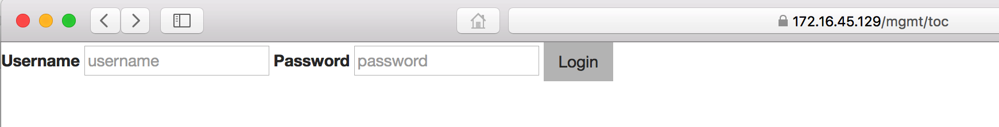
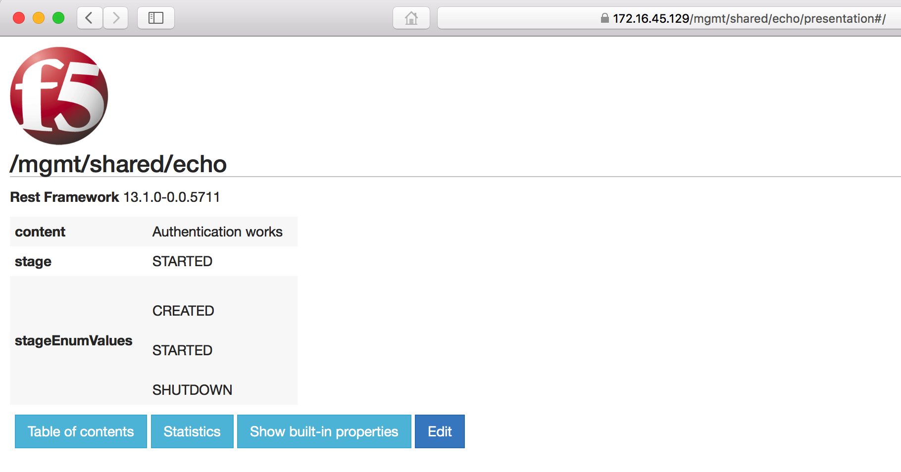

Lab 2.1 - Interact with a REST extension
----------------------------------------

In this exercise we are going to look at an iControlLX extension that ships
with iControl. This is the iControlLX 'presentation' extension.

Typically, when you login to iWorkflow via the Web Interface you are redirected
to `/mgmt/xui`. In this exercise we are going to review the REST API via the
Web interface, which looks like this:

Task 1 - View the API via web browser

1. In your browser, navigate to (replacing `<ip_address>` as appropriate):
https://<ip_address>/mgmt/toc

2. Enter the 'admin' user credentials.
You are now presented with the top level of REST collections/resource available
on the iWorkflow platform.

.. image:: _static/image003.png

Task 2 - Interact with a REST resource

1. To filter the list of iControl REST resources, navigate to the textbox at the
top of the page and enter 'echo':

.. image:: _static/image004.png

2. Click on the 'echo' resource.

Task 3 - The '/presentation#' extension

Note that the URI has `/presentation#/` appended to the end of it. This is an
iControlLX extension responsible for rendering the iControl REST resource in the
web interface.

1. Remove the appened presentation#/ and note the raw JSON representation:

.. image:: _static/image006.png

2. Click the 'back' button in your browser to return to the /presentation#/
view. The URL should now be:

`https://<ip_address>/mgmt/shared/echo/presentation#/`

Task 4 - Editing a REST resource

1. Click the blue 'edit' button. You should now see this:

.. image:: _static/image007.png

This allows you to edit the value of the '/mgmt/shared/echo' REST resource, via
the 'presentation' extension.

2) Click on the blue 'advanced' button. Now you can see the raw JSON
representation of the REST resource.

.. image:: _static/image008.png

3) Try editing the REST resource. Remove the 's' off the end of 'Authentication
Works'. Note that it synchornizes between the textboxes and the raw 'JSON
input' textfield.

You are now interacting with the iControlLX presentation extension.

4) Click the blue 'cancel' button to discard your changes.
