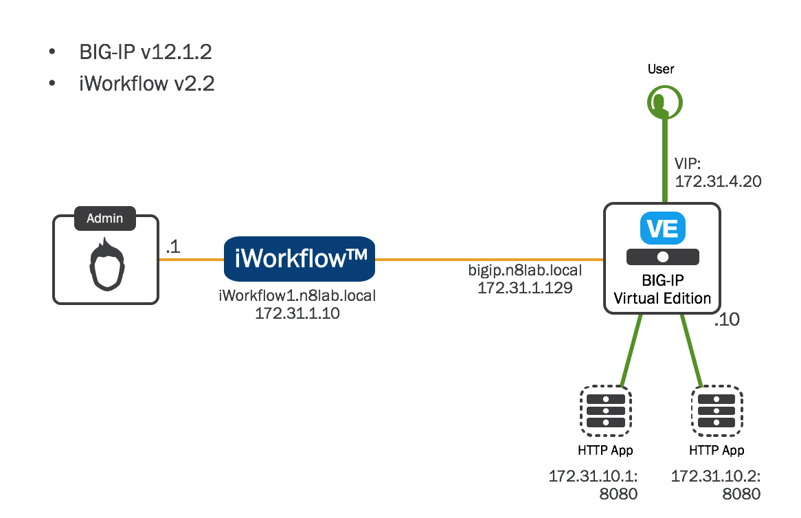

======================================
F5 iControlLX Extensions Training Lab
======================================

Module 2 - Interacting with an iControlLX extension
---------------------------------------------------

In module 2 we are going to introduce the basic themes and then review an
iContolLX extension.

The Lab Environment
-------------------

The following exercises will be performed on the iWorkflow platform. If you
don't have one, grab yourself an eval license! While the iControlLX framework
does run on both BIG-IP and iWorkflow, there are many workflows that don't make
sense to run directly on the BIG-IP. For example, if we developed an extension
that presented the status of a Fleet of BIG-IP devices, it would make far more
sense to do this from a central platform, than at each individual BIG-IP.

This is the environment for the Training Lab:

.. Note
This lab will NOT guide you through the iWorkflow or BIG-IP lab setup. For
information on installing and configuring, please visit:

* `iWorkflow <https://devcentral.f5.com/wiki/iWorkflow.HomePage.ashx>`_
* `BIG_IP <https://support.f5.com/csp/knowledge-center/software/BIG-IP?module=BIG-IP%20LTM>`_

**Exercises in this Module**

Lab 2.1 - Interact with a REST extension
Lab 2.2 - Edit an iControl REST resource via /mgmt/toc
Lab 2.3 - Advanced (raw JSON)
